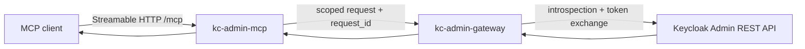

# keycloak-admin-mcp

[](https://github.com/sednalabs/keycloak-admin-mcp/actions/workflows/release-hygiene.yml)
[](https://github.com/sednalabs/keycloak-admin-mcp/actions/workflows/kc-admin-mcp-hosted-tests.yml)
[](https://github.com/sednalabs/keycloak-admin-mcp/actions/workflows/codeql.yml)
[](https://github.com/sednalabs/keycloak-admin-mcp/actions/workflows/dependency-governance.yml)
[](https://github.com/sednalabs/keycloak-admin-mcp/actions/workflows/osv-scanner.yml)
[](LICENSE)

High-trust Keycloak administration for MCP clients.

`keycloak-admin-mcp` is a Rust Model Context Protocol server for operating
Keycloak through a narrow, audited, policy-first boundary. It is designed for
the uncomfortable part of agent operations: letting a capable client help with
identity administration without handing the MCP server long-lived admin
credentials or exposing a generic admin proxy.

The repository ships two cooperating services:

| Service | Role |
| --- | --- |
| `kc-admin-mcp` | The MCP resource server. It exposes the tool surface, verifies caller authorization, publishes OAuth protected-resource metadata, and records audit/metrics context. |
| `kc-admin-gateway` | The required security gateway. It owns Keycloak admin credential isolation, introspection, RFC 8693 token exchange, route policy, and downstream admin calls. |

## Why It Exists

Keycloak administration is powerful enough that a "thin wrapper around the
Admin REST API" is the wrong shape. This project treats each administrative
operation as a policy decision with a request ID, explicit caller authority, a
bounded route family, and an audit trail.

The result is an MCP server that can be pleasant for an operator to use while
remaining conservative about the blast radius:

- the MCP service never embeds Keycloak admin credentials;
- the gateway is the only component that exchanges user authority for admin
  authority;
- tools are grouped by Keycloak domain rather than exposed as raw HTTP;
- destructive operations require explicit confirmation where supported;
- secret-bearing tools are disabled unless deliberately enabled;
- auth failures use structured reason codes that can be correlated through logs.

## Architecture



Important boundaries:

- `kc-admin-mcp` acts as an OAuth 2.1 resource server for MCP clients.
- `kc-admin-gateway` centralizes Keycloak admin access and policy enforcement.
- Request IDs propagate across the MCP and gateway layers for audit/debugging.
- Raw tokens and Authorization headers are not logged.

## What You Get

| Capability | Why it matters |
| --- | --- |
| OAuth protected-resource metadata | MCP clients can discover how to authenticate against `/mcp`. |
| Device-auth discovery | Headless clients can use OAuth device flow when the issuer supports it. |
| Streamable HTTP transport | The server supports the modern MCP HTTP transport shape, including configurable session resume behavior. |
| Scope and role gates | Tools require explicit Keycloak-admin scopes and projected roles before they execute. |
| Required security gateway | High-privilege Keycloak credentials stay out of the MCP process. |
| Tool schema snapshots | The exported MCP tool contract is versioned and regression-tested. |
| Audit and metrics resources | Operators can inspect server status, audit data, and metrics without scraping internals. |
| Startup admission checks | Production starts can be gated on expected build/provenance/test evidence. |

## Tool Surface

The server exposes domain-shaped tools instead of a generic "call any admin
endpoint" escape hatch.

Current tool families include:

- users: list, get, create, delete, reset passwords, sessions, groups, role
  mappings, required actions, consents;
- groups: list, get, create, delete, members, realm roles, client roles;
- roles: list, get, create, delete, composites, user membership;
- clients: list, search, get, create, update, enable/disable, delete, redirect
  URI updates, bulk updates, pruning, service-account roles;
- client scopes: list, get, create, delete, protocol mappers, scope mappings;
- realm operations: realm list, keys, event configuration, authentication
  flows, default scopes, SMTP test, client registration policies;
- observability: status, metrics, audit listing, audit checkpointing;
- events: user events and admin events, with clear/cleanup operations gated as
  destructive actions.

See [`kc-admin-mcp/README.md`](kc-admin-mcp/README.md) for configuration and
[`docs/SAFETY_CHECKLIST.md`](docs/SAFETY_CHECKLIST.md) before adding or
changing privileged tools.

## Policy Stack And Assurance Direction

This project is intentionally part of a wider policy-first MCP ecosystem.
Today, it consumes shared Rust toolkit crates from
[`mcp-toolkit-rs`](https://github.com/sednalabs/mcp-toolkit-rs), including
`mcp-toolkit-policy-core` for reusable deterministic policy primitives such as
edge/path validation.

The broader Sedna policy-kernel work is being prepared separately. Its assurance
story is deliberately bounded:

- SPARK is used for proof-checked runtime decision slices and C ABI integration
  paths where deterministic policy decisions are small enough to verify.
- F* / EverParse is used for machine-checked ingress parsing of the supported
  PKV1 policy-input boundary and for abstract auth/control-plane models.
- JSON vectors and hosted conformance lanes keep Rust, SPARK, and extracted
  artifacts aligned where a slice is covered.

This repository does not claim full-system proofs of Keycloak, OAuth, TLS,
HTTP parsing, JSON parsing, databases, deployment behavior, or every admin
operation. It is a high-trust MCP server and a practical consumer of the policy
toolkit direction. When the formal policy repository is public, this README
should link to the exact contracts, proof artifacts, and runtime integration
status.

## Quick Start

Prerequisites:

- Rust toolchain.
- A reachable Keycloak instance.
- A confidential introspection client.
- A confidential token-exchange client with narrowly scoped realm-management
  authority.
- A user token that projects the scopes and roles needed for the requested
  tools.

Build the workspace:

```bash
cargo build --workspace
```

Start the gateway and MCP server with the environment shown in
[`docs/RUNBOOK.md`](docs/RUNBOOK.md):

```bash
# Terminal 1: start the gateway
cargo run -p kc-admin-gateway
```

```bash
# Terminal 2: start the MCP server
cargo run -p kc-admin-mcp
```

The default local MCP endpoint is:

```text
http://127.0.0.1:9400/mcp
```

Check discovery:

```bash
curl -sS http://127.0.0.1:9400/.well-known/oauth-protected-resource/mcp
curl -sS http://127.0.0.1:9400/.well-known/oauth-authorization-server/mcp
```

Headless device-auth clients can then start the OAuth flow, for example:

```bash
codex mcp login keycloak-admin-mcp --device-auth
```

A successful OAuth login does not bypass server-side scope and role checks. If
the linked principal does not project the required Keycloak-admin roles, tools
will still fail closed with structured auth reasons such as
`auth.missing_roles`.

## Operator Docs

- [`docs/RUNBOOK.md`](docs/RUNBOOK.md): end-to-end gateway and MCP operation.
- [`SECURITY.md`](SECURITY.md): token handling, edge parsing, and least
  privilege guidance.
- [`docs/SAFETY_CHECKLIST.md`](docs/SAFETY_CHECKLIST.md): checklist for
  privileged tool changes.
- [`docs/TEST_PLAN.md`](docs/TEST_PLAN.md): unit, integration, device-auth, and
  mTLS validation paths.
- [`docs/provenance-test-gate-design.md`](docs/provenance-test-gate-design.md):
  startup admission and build/test provenance design.
- [`kc-admin-gateway/README.md`](kc-admin-gateway/README.md): gateway-specific
  configuration.
- [`kc-admin-mcp/README.md`](kc-admin-mcp/README.md): MCP-server-specific
  configuration.

## Validation

The public repository is wired for hosted validation through GitHub Actions,
including release hygiene, hosted tests, CodeQL Advanced, dependency
governance, DevSkim, OSV Scanner, coverage, and SARIF upload workflows.

Useful local commands while developing:

```bash
cargo test --workspace
cargo test -p kc-admin-mcp
cargo test -p kc-admin-gateway
```

Tool schema changes should update the snapshot contract intentionally:

```bash
# Strict contract check
cargo test --locked -p kc-admin-mcp tool_schema_snapshot_contract_is_stable

# Intentional rebaseline
MCP_TOOLKIT_UPDATE_TOOL_SNAPSHOTS=1 cargo test --locked -p kc-admin-mcp tool_schema_snapshot_contract_is_stable
```

Prefer the documented hosted workflows for release or publication evidence.

## Repository Map

```text
kc-admin-gateway/       Security gateway and Keycloak Admin REST bridge
kc-admin-mcp/           MCP server, tools, resources, auth, audit, metrics
docs/                   Runbooks, safety checklist, test plan, provenance docs
spec/                   Tool schema snapshot contract
.github/workflows/      Hosted validation and security workflows
```

## Status

This is an Apache-2.0 Rust repository under active development. Source is public
and validation workflows are published. GitHub Releases and registry packages
may be added separately; until then, treat the repository source and hosted
workflow artifacts as the primary distribution surfaces.

## License

Apache-2.0. See [`LICENSE`](LICENSE).
