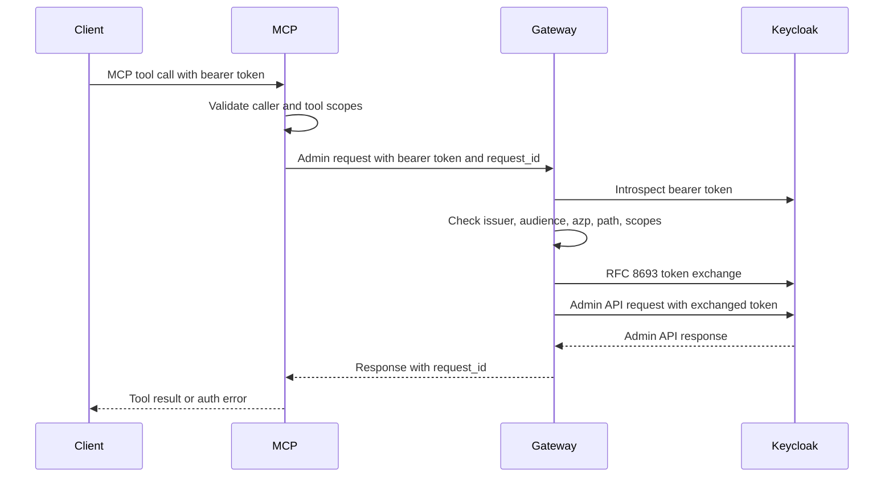

# Delegated Admin Token-Exchange Design

Status: design record for the opt-in delegated-admin/token-exchange model.
Implementation is out of scope for this document.

## Purpose

`kc-admin-mcp` currently uses the gateway as the high-trust enforcement point:
the MCP server checks caller scopes and roles, the gateway introspects the
incoming bearer token, maps the admin route to required scopes, exchanges the
caller token, and forwards the resulting admin token to Keycloak.

That model is intentionally safe by default, but it leaves a policy question
implicit: when should a caller be allowed to exchange a token for a Keycloak
admin action, and what should constrain the exchanged token?

This document defines the decision boundary for an opt-in delegated-admin mode.
Keycloak remains the security token service (STS) and Admin API authority. The
gateway owns the local policy decision before exchange and fails closed when the
decision cannot be made.

## External Constraints

- RFC 8693 defines token exchange as an STS-style grant for issuing a new token
  from one or more input tokens. It distinguishes impersonation from delegation:
  impersonation makes the issued token identify the subject, while delegation
  keeps the actor visible as acting for the subject.
- Keycloak standard token exchange is the maintained path for internal token
  exchange. It requires a confidential requester client, accepts bearer access
  tokens as subject tokens, and requires the requester to be in the subject
  token audience unless the requester exchanges its own token.
- Keycloak standard token exchange currently does not support the RFC 8693
  `resource` parameter or RFC 8693 delegation semantics. It can issue tokens
  scoped/audienced for a target, but the gateway must preserve local policy and
  audit semantics.
- Keycloak legacy token exchange supports more use cases, including
  impersonation, but is preview/deprecated and should not be the normal path.
- Keycloak fine-grained admin permissions can constrain Admin API access for
  delegated realm administrators, but broad admin and realm-admin roles bypass
  those permissions. Treat FGAP as a Keycloak-side defense-in-depth layer, not as
  a replacement for gateway policy.

References:

- RFC 8693: https://datatracker.ietf.org/doc/html/rfc8693
- Keycloak token exchange: https://www.keycloak.org/securing-apps/token-exchange
- Keycloak fine-grained admin permissions:
  https://www.keycloak.org/docs/latest/server_admin/#delegating-realm-administration-using-permissions

## Current Flow

## Candidate Models

| Model | Summary | Fit |
| --- | --- | --- |
| Static gateway service account | Gateway exchange client holds fixed realm-management roles and requests the minimum route scopes. | Default. Simple, auditable, compatible with current code. Risk is over-broad service account configuration. |
| Guarded standard token exchange | Gateway makes a local policy decision, then asks Keycloak standard token exchange for a bearer access token with bounded scopes/audience. | Recommended opt-in proof of concept. Uses the maintained Keycloak path while keeping policy explicit. |
| Keycloak FGAP-backed delegation | Keycloak fine-grained admin permissions constrain what the exchanged token can do through the Admin API. | Useful defense-in-depth where operators can maintain FGAP. Does not replace gateway checks. |
| Legacy token exchange / impersonation | Use Keycloak legacy token exchange to request impersonation-style admin tokens. | Not recommended. Preview/deprecated and too risky as a default. Consider only as a separately approved compatibility mode. |
| UMA or application authorization | Model admin operations as protected application resources. | Poor fit for this gateway. Admin API authorization remains Keycloak-admin specific and should stay close to gateway route policy. |

## Recommended Mode

Keep static gateway service-account roles as the default. Add an opt-in
`standard_token_exchange` mode only after the policy oracle exists and has
explicit negative-path coverage.

Suggested future configuration:

- `KC_GATEWAY_EXCHANGE_MODE=static|standard_token_exchange`
- `KC_GATEWAY_EXCHANGE_POLICY_MODE=advisory|enforce`
- `KC_GATEWAY_EXCHANGE_ALLOWED_AUDIENCES=<comma-separated client ids>`
- `KC_GATEWAY_EXCHANGE_MAX_TTL_S=<seconds>`
- `KC_GATEWAY_EXCHANGE_ALLOW_REFRESH_TOKEN=false`
- `KC_GATEWAY_EXCHANGE_ALLOW_RESOURCE=false`
- `KC_GATEWAY_EXCHANGE_REQUIRE_REQUESTER_AUDIENCE=true`

The first implementation should run in `advisory` mode for logs and test
artifacts, then move to `enforce` only when the vector corpus proves there are
no silent scope, audience, realm, or actor-chain widenings.

## Policy Oracle Boundary

The gateway policy oracle decides whether an exchange is allowed. It receives
canonical inputs only; it does not parse JWTs, verify signatures, call Keycloak,
or inspect raw HTTP.

Inputs:

- `request_id`
- `issuer`
- `subject`
- `actor_client_id` from `azp` or `client_id`
- `audiences`
- `token_scopes`
- `subject_token_remaining_ttl_s`, precomputed at the parsing boundary so the
  oracle does not read wall-clock time
- `requested_ttl_s`, when the caller or gateway requests a bounded downstream
  token lifetime
- `proof_mode` (`bearer`, `dpop`, `mtls`, or `unknown`)
- `admin_realm`
- `http_method`
- `route_family`
- `required_scopes`
- `exchange_mode`
- `requested_audience`
- `requested_resource`
- `requested_token_type`
- `act_chain_present`
- `may_act_present`
- `policy_config`, containing allowlisted requester clients, allowed exchange
  audiences/resources, realm policy, route policy, `max_ttl_s`, and
  `require_requester_audience`

Outputs:

- `decision`: `allow` or `deny`
- `reason`: stable reason bucket
- `required_scopes`
- `exchange_audience`
- `exchange_resource`
- `max_ttl_s`
- `audit_subject`
- `audit_actor_client`
- `policy_version`

The initial implementation can be Rust-only, but the input/output shape should
be suitable for the auth/control-plane policy kernel so F*/SPARK vectors can
cover the pure decision.

## Decision Matrix

| Condition | Decision | Reason |
| --- | --- | --- |
| Issuer mismatch | Deny | `issuer_mismatch` |
| Gateway audience missing from subject token while `policy_config.require_requester_audience` is enabled | Deny | `audience_mismatch` |
| `azp`/`client_id` not allowlisted | Deny | `requester_not_allowed` |
| Sender-constrained subject token in standard exchange mode | Deny | `sender_constrained_subject_unsupported` |
| `requested_resource` set while using Keycloak standard token exchange | Deny | `resource_parameter_unsupported` |
| Requested token type is refresh token | Deny by default | `refresh_token_not_allowed` |
| Required scope not already present on caller token | Deny | `scope_escalation` |
| Requested exchange audience not allowlisted | Deny | `exchange_audience_not_allowed` |
| Route family is not gateway allowlisted | Deny | `route_not_allowlisted` |
| Realm is outside configured realm policy | Deny | `realm_not_allowed` |
| `act` or `may_act` chain present before chain semantics are implemented | Deny | `actor_chain_unsupported` |
| Subject-token remaining TTL or requested exchange TTL exceeds `policy_config.max_ttl_s` | Deny | `token_ttl_too_long` |
| Missing request_id or audit subject | Deny | `audit_binding_missing` |
| All canonical checks pass | Allow | `allowed` |

## MCP UX Contract

Capability metadata should expose only the mode and limitations, not secrets or
Keycloak internals:

- `exchange_mode`: `static`, `standard_token_exchange_advisory`, or
  `standard_token_exchange_enforced`
- `supported_proof_modes`: initially `bearer`
- `delegation_semantics`: initially `not_supported`
- `impersonation_semantics`: initially `not_supported`
- `resource_parameter`: initially `not_supported`

Errors should carry `request_id`, HTTP status, and the stable reason bucket.
They must not include raw tokens, secrets, subject identifiers, or raw exchange
response bodies.

## Proof-of-Concept Plan

1. Add pure Rust policy-decision vectors for the matrix above.
2. Run advisory-mode decisions beside the current gateway flow and log
   `request_id`, mode, decision, reason, route family, and scope set.
3. Configure a Keycloak confidential exchange client with standard token
   exchange enabled and the gateway/requester audience present on subject
   tokens.
4. Prove allowed exchange for a read-only route and denied exchange for scope
   widening, audience mismatch, unsupported resource, unsupported actor chain,
   and refresh-token requests.
5. Add an integration smoke that calls through MCP -> gateway -> Keycloak using
   placeholders and opt-in environment variables.
6. Promote to enforce mode only after the hosted run shows green policy vectors,
   gateway unit coverage, and an opt-in authenticated smoke.

## Test Strategy

- Unit: pure policy matrix with whole-object expected decisions.
- Gateway unit: route-to-scope selection remains unchanged and feeds the policy
  oracle with canonical inputs.
- Integration: opt-in Keycloak standard token exchange smoke for allowed and
  denied cases.
- Audit: every deny emits a stable reason bucket and `request_id`; no raw token
  or secret appears in logs.
- Regression: public clients, sender-constrained subject tokens, refresh-token
  requests, unsupported `resource`, and actor-chain claims fail closed.

## Open Decisions

- Exact policy-kernel contract version and vector file location.
- Whether realm policy is a static allowlist, a Keycloak realm attribute, or a
  higher-level deployment profile.
- Whether advisory-mode evidence should be surfaced through MCP metadata or only
  through gateway logs.
- Whether Keycloak FGAP should be mandatory in production profiles or remain an
  operator-controlled defense-in-depth layer.
